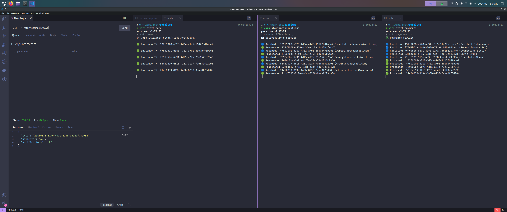

# Ejemplo práctico de RabbitMQ

> Código de práctica y revisión por parte del equipo de [CleverIT](https://www.cleveritgroup.com/), sobre el uso del broker [RabbitMQ](https://www.rabbitmq.com/) para el manejo de mensajes entre aplicaciones.

El ejemplo cuenta con 3 piezas:

- **Core:** Un publisher, usando Fastify, se encarga de enviar los datos a rabbitmq
- **Notifications:** Un consumer, solo usa la librería amqplib para gestionar la conexión. Para emular el tiempo de carga se le agregó 1 segundo.
- **Payments:** Un consumer, al igual que notifications, solo usa la librería amqplib y para el tiempo de carga se le agregó 5 segundos.

## Uso

Ejecutar el **docker-compose** para iniciar RabbitMQ en la URL: http://localhost:15672/ `(usuario y contraseña son: guest)`

```bash
docker-compose up
```

### Para ejecutar el Core y los servicios:

Instalar dependencias
```bash
yarn
```

Iniciar Core
```bash
yarn start:core
```

Iniciar Notifications
```bash
yarn start:notifications
```

Iniciar Payments
```bash
yarn start:payments
```

## Screenshot

